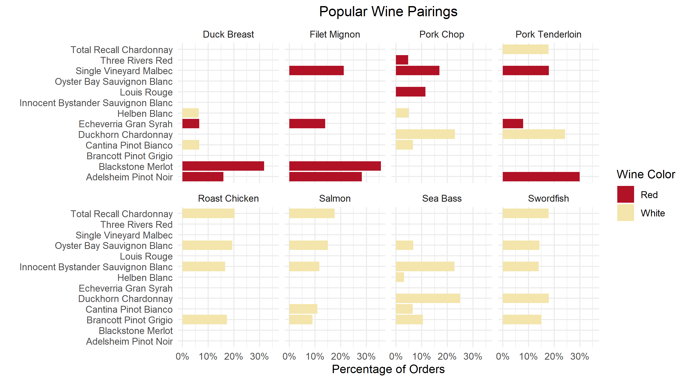
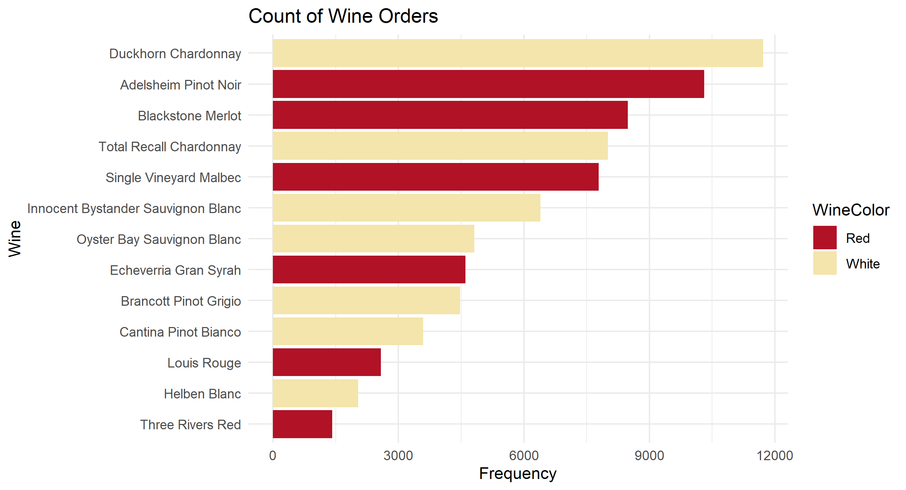
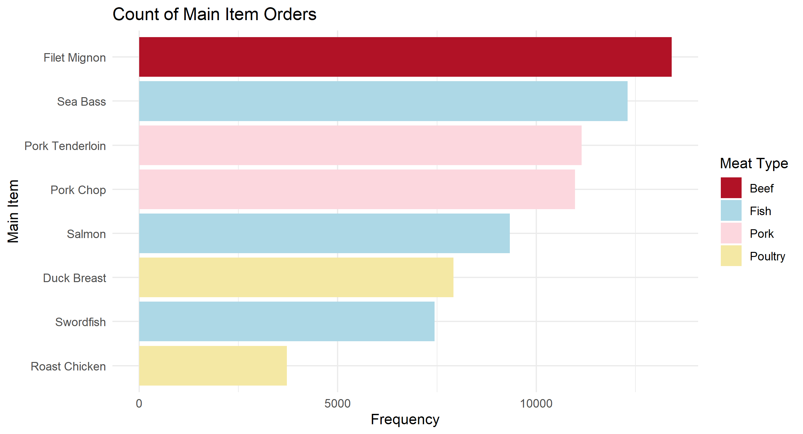
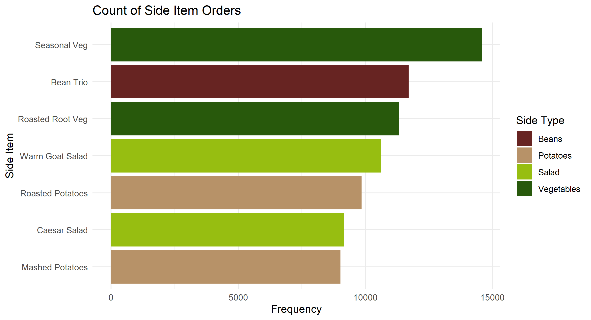

# Market Basket Analysis for Wine Pairings

### Overview
To better understand customer ordering habits and add wine pairing suggestions to the menu that would appear next to each entrée on the core menu, we analyzed over 76,000 individual orders for a restaurant. Entrée/wine pairings accounting for more than 20% of orders for a specific entrée were automatically included in the recommendations. The most frequently paired wine was always chosen as a recommendation, even if it was ordered less than 20% of the time.  Popular pairings that did not reach the 20% threshold were evaluated on a case-by-case basis.

### Data Visualizations:
 

